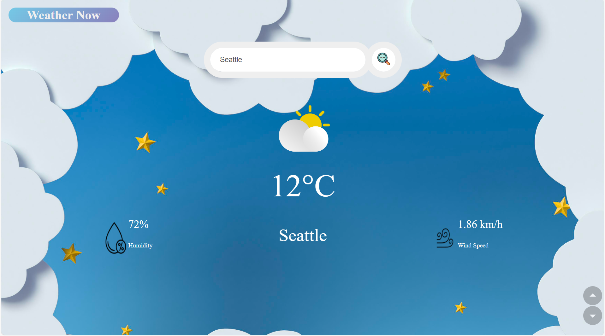

# 🌤️ Weather Now

A simple and elegant **Weather App** built with **HTML, CSS, and JavaScript**, using the **OpenWeatherMap API** to display real-time weather information for any city around the world.  

---

## 🌍 Overview

The **Weather Now** app allows users to check live weather conditions by entering a city name.  
It displays key information such as:

- 🌡️ Temperature (°C)  
- 💧 Humidity (%)  
- 🌬️ Wind Speed (km/h)  
- ☁️ Weather condition icon  

The interface updates dynamically after each search, with friendly error handling for invalid city names.

---

## ✨ Features

- 🔎 **Search by city name**  
- 🌦️ Displays real-time weather data  
- 📡 Uses **OpenWeatherMap API** for live updates  
- ❌ Error message for invalid locations  
- 🧠 **Dynamic DOM updates** — no page reloads  
- 💅 Clean, modern design  

---

## 🧰 Technologies Used

- **HTML5** – Structure  
- **CSS3** – Styling and layout  
- **JavaScript (ES6)** – API handling, logic, and interactivity  
- **OpenWeatherMap API** – Weather data source  

---

